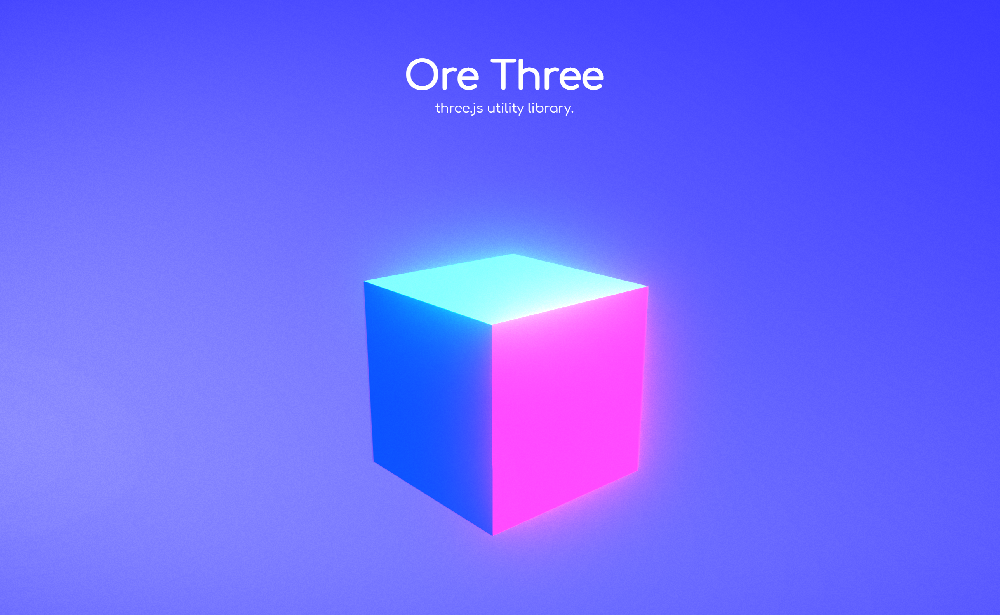

# Ore Three
[three.js]( https://github.com/mrdoob/three.js ) utils.



[Documentation](https://ore-three-ts.ukon.dev/documentation)
[Examples]( https://ore-three-ts.ukon.dev/examples/ )


### install
You can get the library from [npm]( https://www.npmjs.com/package/ore-three-ts ).

```bash
$ npm install ore-three-ts
```

##### Import

```javascript
import * as ORE from 'ore-three-ts';
```

### Create Controller

```typescript
import * as ORE from 'ore-three-ts';

import { ControllerScene } from './ControllerScene';

export class APP {

	private controller: ORE.Controller;

	constructor() {

		this.controller = new ORE.Controller();

		this.controller.addLayer( new ControllerScene(), {
			name: 'Main',
			canvas: document.querySelector( '#canvas' ) as HTMLCanvasElement,
		} );

	}

}

window.addEventListener( 'load', () => {

	let app = new APP();

} );
```

### Create Scene

```typescript
import * as THREE from 'three';
import * as ORE from 'ore-three-ts';

export class ControllerScene extends ORE.BaseLayer {

	private box: THREE.Mesh;

	constructor() {

		super();

	}

	public onBind( info: ORE.LayerInfo ) {

		super.onBind( info );

		this.camera.position.set( 0, 1.5, 4 );
		this.camera.lookAt( 0, 0, 0 );

		this.box = new THREE.Mesh( new THREE.BoxGeometry(), new THREE.MeshNormalMaterial() );
		this.scene.add( this.box );

	}

	public animate( deltaTime: number ) {

		this.box.rotateY( 1.0 * deltaTime );

		this.renderer.render( this.scene, this.camera );

	}

	public onResize() {

		super.onResize();

	}

	public onTouchStart( args: ORE.TouchEventArgs ) {

	}

	public onTouchMove( args: ORE.TouchEventArgs ) {

	}

	public onTouchEnd( args: ORE.TouchEventArgs ) {

	}

	public onHover( args: ORE.TouchEventArgs ) {

	}

	public onWheel( event: WheelEvent, trackpadDelta: number ) {

	}


}
```